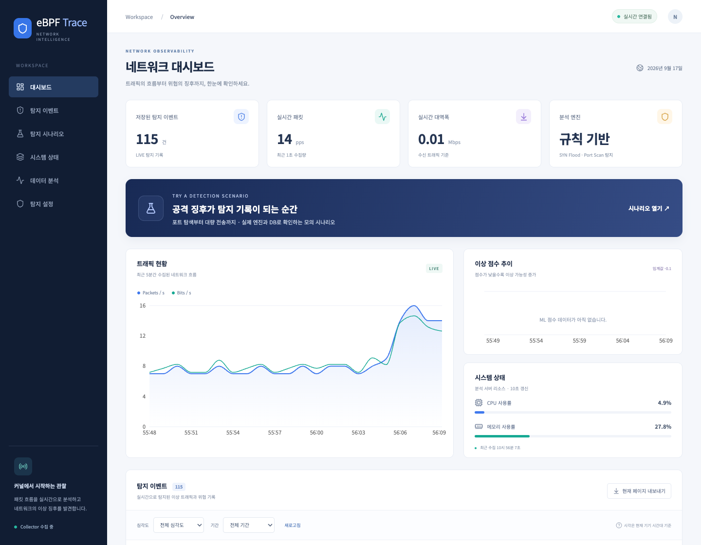
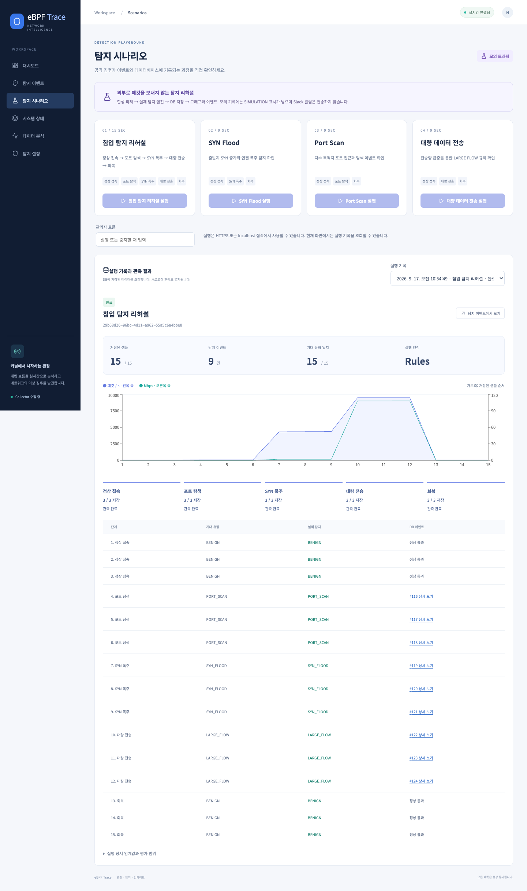
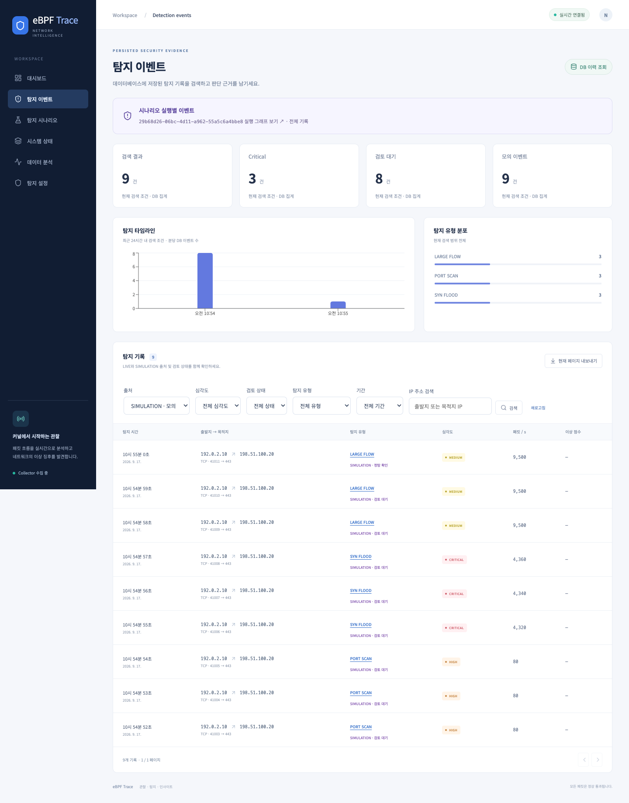
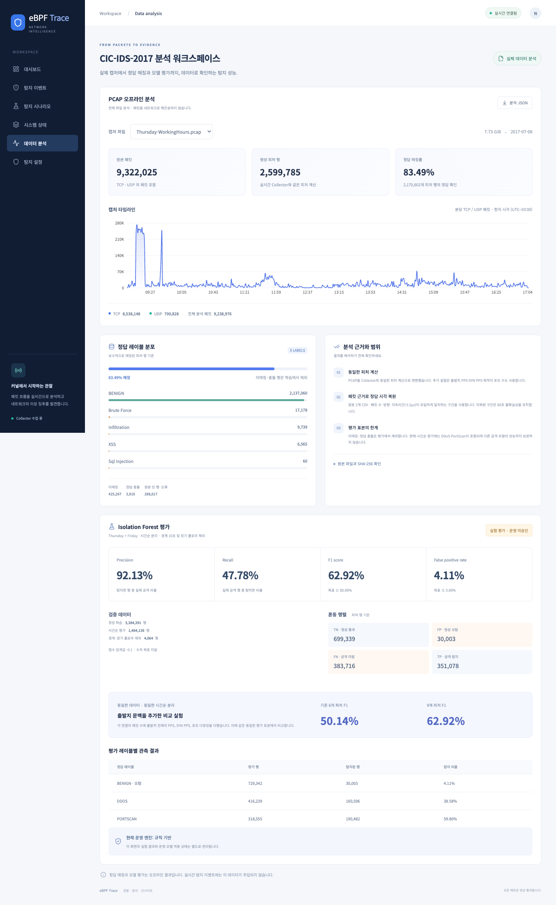
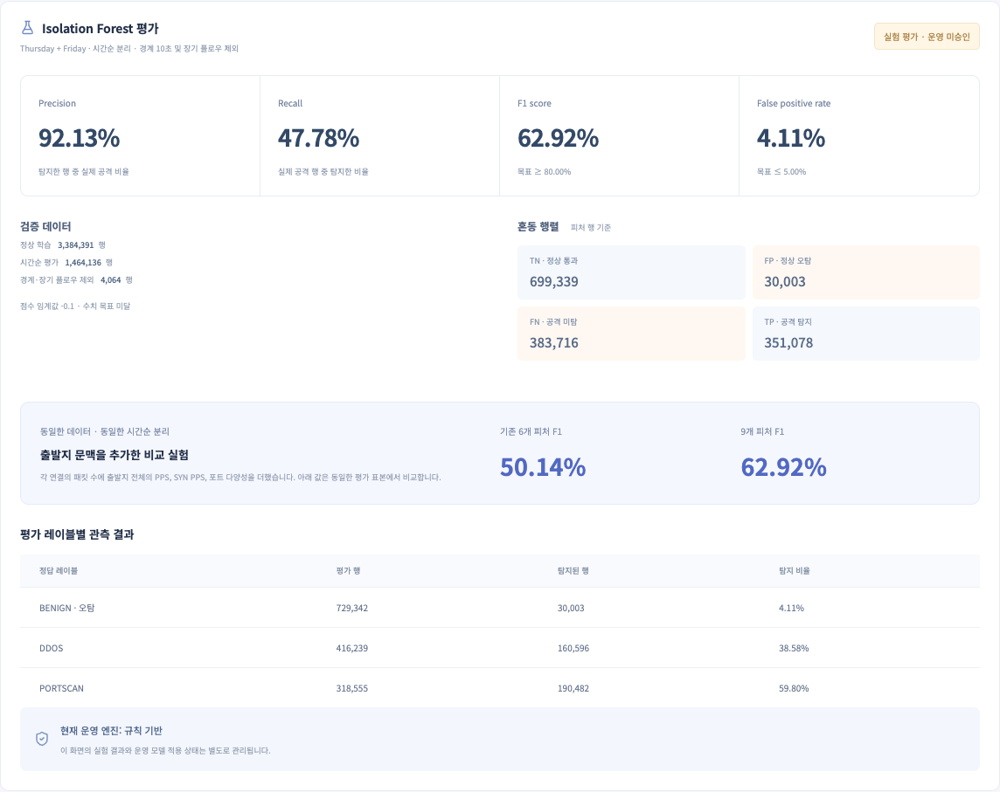
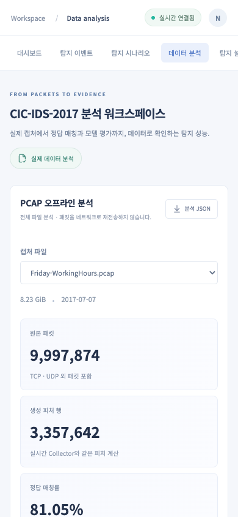

<p align="center">
  <a href="https://skillicons.dev"></a>
</p>

<h1 align="center">eBPF Trace</h1>
<p align="center"><strong>See the traffic. Understand the threat.</strong><br/>커널의 패킷 흐름을 실시간 탐지와 검증 가능한 데이터로 연결합니다.</p>

<p align="center">
  <a href="https://github.com/DevLSJ/eBPF-Trace/actions/workflows/ci-cd.yml"></a>
  
  
  
</p>

<p align="center">
  <a href="http://52.62.165.10"><strong>대시보드 열기 ↗</strong></a> ·
  <a href="http://52.62.165.10/#scenarios">시나리오 실습</a> ·
  <a href="http://52.62.165.10/#events">탐지 이벤트</a> ·
  <a href="http://52.62.165.10/#capture">데이터 분석</a> ·
  <a href="docs/operations.md">실행 · 운영 가이드</a> ·
  <a href="docs/verification-2026-09-17-upgrade.md">검증 기록</a>
</p>

---

## A closer look

Ubuntu VM의 **eBPF/XDP**가 관찰한 트래픽을 **FastAPI**가 분석·저장하고, **React** 대시보드가 WebSocket으로 전달받습니다. 원본 PCAP과 정답 CSV는 별도의 오프라인 경로에서 검증합니다. 모든 패킷은 `XDP_PASS`로 통과하며 자동 차단은 하지 않습니다.



| Live observability | Event investigation | Data evidence |
|:---|:---|:---|
| 패킷·대역폭·시스템 자원 실시간 표시 | 심각도·기간·유형·출발지/목적지 IP 검색 | 캡처 타임라인·프로토콜·정답 분포 |
| Collector·Redis·WebSocket 연결 상태 | 피처 상세 조회·페이지별 JSON 내보내기 | 매칭률·제외 사유·혼동 행렬·평가 JSON |
| 규칙 기반 탐지와 장애 후 재연결 | 인증된 관리자 임계값 저장 | 실험 성능과 운영 엔진 상태 구분 |

## Rehearse. Detect. Investigate.

**대시보드에서 실행하고, DB에서 근거를 찾습니다.** 침입 탐지 리허설은 정상 접속 → 포트 탐색 → SYN 폭주 → 대량 전송 → 회복을 15초 동안 재현합니다. 실제 탐지 엔진을 거친 모의 데이터가 실행별 그래프와 탐지 이벤트로 연결됩니다.



| Run a scenario | Follow the evidence | Close the review |
|:---|:---|:---|
| 4개 시나리오 · 실행·중지 버튼 | 실행 ID로 샘플과 이벤트 추적 | 정탐·오탐·검토 대기 판정 |
| 실제 엔진 · 당시 임계값 보존 | DB 집계 그래프 · 출처별 필터 | 메모 저장 · 새로고침 후 복원 |
| 명시적 SIMULATION 표시 | 원본 피처와 기대 유형 대조 | 실시간 수집 트래픽과 분리 |



외부로 공격 패킷을 보내지 않으며 Slack 알림도 전송하지 않습니다. 실행·검토 저장은 HTTPS 또는 localhost에서 관리자 인증 후 가능합니다. [시연 순서와 API →](docs/scenarios.md)

## From packets to evidence



<details>
<summary><strong>모델 평가와 모바일 화면 보기</strong></summary>

<p align="center"></p>
<p align="center"></p>

</details>

2026-09-17 기준 실제 CIC-IDS-2017 목요일·금요일 캡처와 제공된 `TrafficLabelling` CSV를 사용했습니다. 화면 캡처는 운영 서버의 실제 API 응답을 사용합니다.

| 데이터 | Thursday | Friday |
|:---|---:|---:|
| 원본 패킷 | 9,322,025 | 9,997,874 |
| 생성 피처 행 | 2,599,785 | 3,357,642 |
| 확실히 매칭된 정답 행 | 2,170,602 | 2,721,376 |
| 정답 매칭률 | 83.49% | 81.05% |

패킷의 방향별 개수·지속시간·양방향 5-tuple을 대조해 CSV의 분 단위 시각을 복원했습니다. 전체 정답 매칭률은 **9.12% → 82.12%**입니다. 모호한 후보와 정답 충돌은 계속 제외합니다.

| 동일한 복원 데이터의 시간순 평가 | 기존 6개 피처 | 출발지 문맥 포함 9개 피처 |
|:---|---:|---:|
| Precision | 90.13% | 92.13% |
| Recall | 34.73% | 47.78% |
| F1 | 50.14% | **62.92%** |
| FPR | 3.83% | 4.11% |

> **운영 엔진은 규칙 기반을 유지합니다.** 개선된 실험도 F1 목표 80%에 미달합니다. 현재 평가 구간은 정상·DDoS·PortScan을 포함하며 전체 공격 유형을 대표하지 않습니다. 이전 F1 2.82%는 다른 매칭 표본이므로 위 결과와 직접 비교할 수 없습니다. [실측 근거와 한계 →](docs/verification-2026-09-17-upgrade.md)

## Built with

| 계층 | 기술 | 역할 |
|:---|:---|:---|
| Kernel | C · eBPF · XDP · BCC | Linux VM에서 패킷 관찰·플로우 집계 |
| Collection | Python · Redis · SQLite outbox | 1초 피처·10초 포트 분포·전송 재시도 |
| API | FastAPI · SQLAlchemy · PostgreSQL 17 | 탐지·영속 저장·REST·WebSocket·관리자 설정 |
| Detection | Rules · scikit-learn | SYN Flood·Port Scan·트래픽 급증·실험 모델 검증 |
| Interface | React 19 · TypeScript · Vite · Recharts · Zustand | 반응형 대시보드·이벤트 조사·데이터 분석 |
| Delivery | Docker Compose · Nginx · GitHub Actions · EC2 | 테스트 → 외부 이미지 빌드 → VM runner 배포 |
| Infrastructure | Terraform | EC2/VPC/SG 정의; 기존 자원 import/plan은 별도 후속 작업 |

## Start locally

Python **3.14**와 Node **24**를 사용합니다. 아래 SQLite 환경은 웹/API 개발용이며, 실제 커널 수집은 Linux VM에서 실행합니다.

```bash
python3.14 -m venv .venv
.venv/bin/python -m pip install -r requirements-dev.txt
DATABASE_URL=sqlite+aiosqlite:///./ebpf.db .venv/bin/python -m alembic upgrade head
DATABASE_URL=sqlite+aiosqlite:///./ebpf.db .venv/bin/python -m uvicorn backend.main:app --reload
```

```bash
# 별도 터미널
cd frontend
npm ci
npm run dev
```

`http://127.0.0.1:5173`에서 확인합니다. Collector가 없으면 실시간 데이터는 수신 대기로 표시되고, 저장된 오프라인 분석 보고서는 바로 조회할 수 있습니다. 관리자 토큰·Redis·VM 수집기·EC2 배포 설정은 [운영 가이드](docs/operations.md)에 정리했습니다.

## Verify & reproduce

```bash
.venv/bin/python -m pytest -q
.venv/bin/python -m ruff check backend collector ml infra
cd frontend
npm run build
npx playwright install chromium
npm run test:e2e
```

- **Python 56개:** 실제 PostgreSQL·Redis를 포함한 검증. 외부 테스트 URL이 없으면 해당 3개는 건너뜁니다.
- **브라우저 14개:** 데스크톱·모바일 검색, 상세, 설정 인증·저장, 재연결, 분석 선택·내보내기, 오류 복구, 시나리오 실행→DB 그래프→이벤트 검토.
- **데이터 추적:** 원본·피처·레이블 결과의 SHA-256, 시간 분리 정책, 제외 건수와 실제 평가 지표를 기록합니다.

원본은 `pcap/`과 `label/`에 두며 Git/Docker에 포함하지 않습니다. 작은 검증 보고서만 `ml/reports/`에 포함합니다. [레이블 결합과 모델 평가 재현 명령](docs/operations.md#탐지학습)을 참고하세요.

## Explore the repository

| 경로 | 내용 |
|:---|:---|
| [`backend/`](backend/) · [`frontend/`](frontend/) | API와 대시보드 |
| [`ebpf-agent/`](ebpf-agent/) · [`collector/`](collector/) | 커널 관찰과 수집 파이프라인 |
| [`ml/`](ml/) · [`ml/reports/`](ml/reports/) | 규칙·레이블 결합·모델 학습·실측 보고서 |
| [`infra/`](infra/) · [`.github/workflows/`](.github/workflows/) | 배포와 자동 검증 |
| [`docs/requirements.md`](docs/requirements.md) · [`docs/design.md`](docs/design.md) | 요구사항과 설계 |
| [`docs/tasks.md`](docs/tasks.md) · [`docs/operations.md`](docs/operations.md) | 진행 상태와 운영 방법 |

<sub>Dataset: <a href="https://www.unb.ca/cic/datasets/ids-2017.html">CIC-IDS2017 · Canadian Institute for Cybersecurity</a> — Sharafaldin, Lashkari & Ghorbani, ICISSP 2018. Stack icons: <a href="https://skillicons.dev">Skill Icons</a>.</sub>
